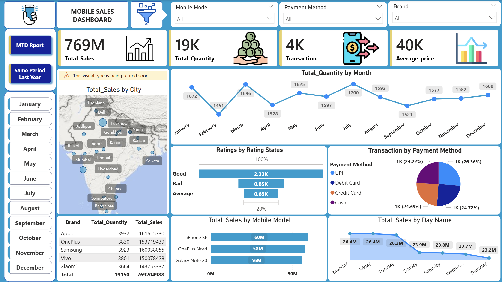
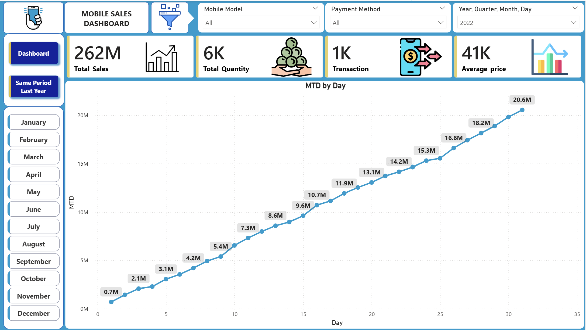
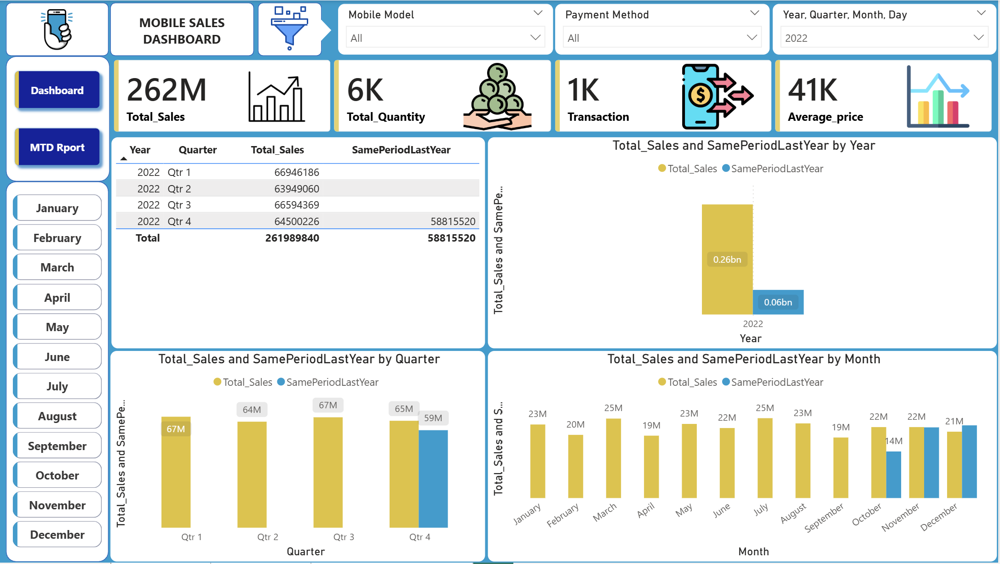

# 📱 Mobile Sales Dashboard – Power BI Project

## 📌 Project Overview
The **Mobile Sales Dashboard** is an interactive Power BI report built to analyze mobile phone sales performance across multiple business dimensions such as time, city, brand, mobile model, payment method, and customer ratings.  
It enables quick decision-making by providing clear KPIs, trends, and year-over-year comparisons.

---

## 🎯 Objectives
- Track overall mobile sales performance
- Monitor Month-to-Date (MTD) sales growth
- Compare sales with the Same Period Last Year (SPLY)
- Analyze sales by city, brand, and mobile model
- Understand customer payment behavior and ratings

---

## 🛠 Tools & Technologies
- Power BI Desktop  
- DAX (Data Analysis Expressions)  
- Data Modeling  
- Excel / CSV Dataset  

---

## 📊 Key KPIs
- **Total Sales**
- **Total Quantity Sold**
- **Total Transactions**
- **Average Price**

---

## 📈 Dashboard Pages

### 1️⃣ Main Dashboard

- Total Sales, Quantity, Transactions, Average Price
- Total Sales by City (Map Visual)
- Monthly Quantity Trend
- Sales by Mobile Model
- Sales by Day Name
- Transactions by Payment Method
- Customer Ratings (Good, Average, Bad)
- Brand-wise Sales & Quantity Table

---

### 2️⃣ MTD (Month-To-Date) Report

- Day-wise cumulative sales trend
- Tracks current month sales performance
- Helps monitor daily growth

---

### 3️⃣ Same Period Last Year (SPLY) Report

- Year-wise sales comparison
- Quarter-wise comparison
- Month-wise comparison
- Performance variance analysis

---

## 📂 Data Model Highlights
- Dedicated Date Table
- Star schema modeling
- Optimized relationships between fact and dimension tables

---

## 📐 DAX Functions Used
- `CALCULATE()`
- `TOTALMTD()`
- `SAMEPERIODLASTYEAR()`
- Time intelligence using Date hierarchy

---

## 📌 Business Insights
- Identifies top-performing cities, brands, and models
- Highlights preferred payment methods
- Tracks sales growth trends
- Compares current performance with previous year

---

## 🚀 Future Enhancements
- Profit and margin analysis
- Regional drill-through
- Forecasting and trend prediction
- Advanced customer segmentation

---

## 👤 Author
**Ajay Kumar Yadav**  
Data Analyst | Power BI | SQL | Excel
